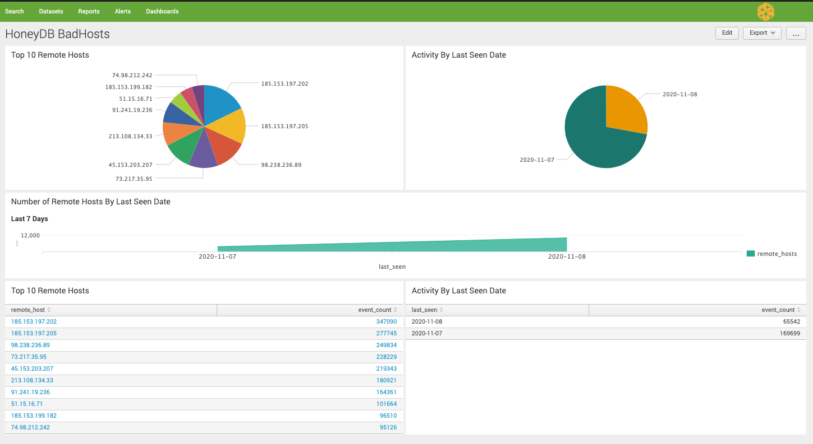
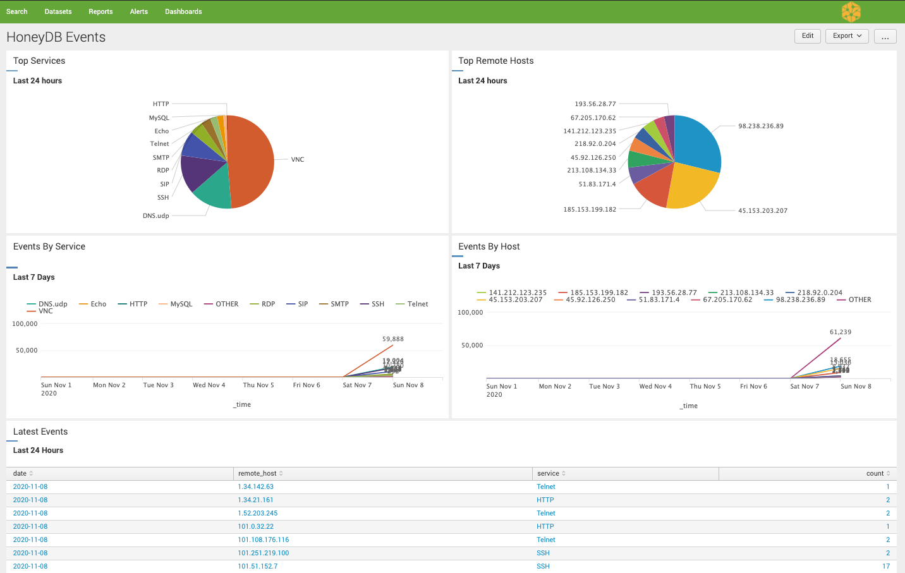

# Splunk TA for HoneyDB

This Splunk App pulls bad host and sensor data form the HoneyDB API.

## Supported Splunk versions

Splunk Enterprise 9.x and 10.x. Dashboards are Simple XML version 1.1, and
the scripted inputs run under Splunk's bundled Python 3 interpreter. The app
ships its own copy of the `requests` library under `lib/`, so it has no
dependency on Splunk's bundled site-packages.

## Enriching your own data

The app maintains a KV-store lookup (`honeydb_badhosts_lookup`) of the
current bad-hosts list, refreshed every 30 minutes by the scheduled search
"HoneyDB - Update BadHosts Lookup". Use the `honeydb_badhost(<field>)`
macro to annotate any events with HoneyDB reputation:

    index=firewall action=allowed
    | `honeydb_badhost(src_ip)`
    | where isnotnull(honeydb_count)
    | table _time, src_ip, honeydb_count, honeydb_last_seen

Matched events gain `honeydb_count` (sightings) and `honeydb_last_seen`.

## CIM compliance

`honeydb_sensor_data` events are mapped to the CIM **Intrusion Detection**
data model (tags `ids` + `attack`) with these fields:

| CIM field | Source |
|---|---|
| `src` | `remote_host` |
| `signature` | `event` + `service` (e.g. `CONNECT VNC`) |
| `transport` | `protocol` (lowercased) |
| `ids_type` | `network` |
| `category` | `service` (lowercased) |
| `severity` | `informational` |
| `vendor_product` | `HoneyDB` |

`dest` is not populated — the sensor-data feed does not include the
honeypot's identity. `honeydb_badhosts` records are reputation data, not
attack events: they get `src` and `vendor_product` aliases but are
intentionally not tagged into the data model.

## Upgrading from 1.x

Version 2.x is a drop-in replacement. Your configuration in
`bin/honeydb.json` keeps working (see the credential store above for the
preferred method — if you replace the app directory wholesale, copy
`bin/honeydb.json` over or create a credential-store entry). The sensor-data
checkpoint now lives at `$SPLUNK_HOME/var/lib/splunk/splunk_ta_honeydb/from_id`
(outside the app directory, so upgrades can't lose it); a legacy
`bin/from_id` file is migrated there automatically on first run.

## Install

Place this app on your search head under `$SPLUNK_HOME/etc/apps/`
Create the index on your indexer, see Create Indexes section below for instructions.

In order for the app to pull data from HoneyDB you must configure your API credentials.

**Recommended: Splunk credential store (encrypted).** Create a credential in
the app's context with realm `splunk_ta_honeydb`, username = your API ID,
password = your API Key:

    curl -k -u admin https://localhost:8089/servicesNS/nobody/splunk_ta_honeydb/storage/passwords \
        -d realm=splunk_ta_honeydb -d name=<your API ID> -d password="<your API Key>"

The inputs read the store via the session key provided by
`passAuth = splunk-system-user` — no secret is written to disk. The
`subscription` setting (not a secret) still lives in `bin/honeydb.json`.

**Deprecated fallback: `bin/honeydb.json`.** If no credential-store entry
exists, the app reads API keys from `bin/honeydb.json` as in earlier
versions. Existing installs keep working unchanged; `honeydb.log` states
which source was used.

__Configuration file: `bin/honeydb.json`__

    {
        "X-HoneyDb-ApiId": "<your key ID>",
        "X-HoneyDb-ApiKey": "<your secret key>",
        "subscription": "<your subscription plan>"
    }

## Create Indexes

Create indexes.conf on your indexer with the default index name "honeydb" Below is the sample of index:

    [honeydb]
    homePath   = $SPLUNK_DB/honeydb/db
    coldPath   = $SPLUNK_DB/honeydb/colddb 
    thawedPath = $SPLUNK_DB/honeydb/thaweddb
    #1 day retention 
    frozenTimePeriodInSecs = 86400
    #14 day retention
    #frozenTimePeriodInSecs = 1209600

__**NOTE:__ If you change the index name, update `default/inputs.conf` to
reflect the new index name (e.g. `index = <new index name>`) and override
the dashboard search scope once in `local/macros.conf` (survives upgrades):

    [honeydb_index]
    definition = index=<new index name>

## Viewing data in Splunk

sourcetype="honeydb_badhosts"

sourcetype="honeydb_sensor_data"

_If you changed index name or sourcetype, please modify the above query accordingly._

## Troubleshooting

- You can view Splunk app error messages by querying `index=_internal source="*splunk/honeydb.log"` or `index=_internal source = *splunkd.log`

## Dashboards

1. Select splunk_ta_honeydb app in the Splunk UI. Go to Dashboards and click on __HoneyDB BadHosts__ or __HoneyDB Events__.

### Bad Hosts

### Sensor Data (Events)

